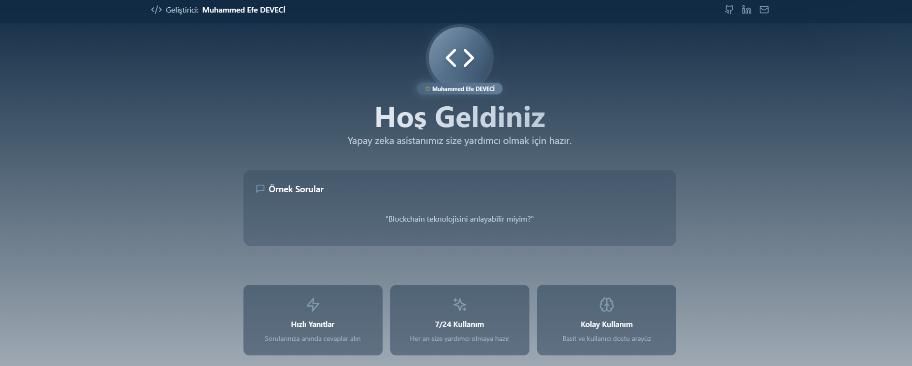
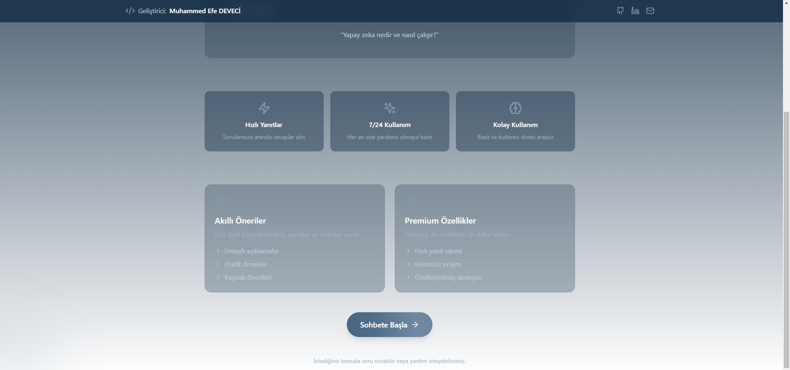
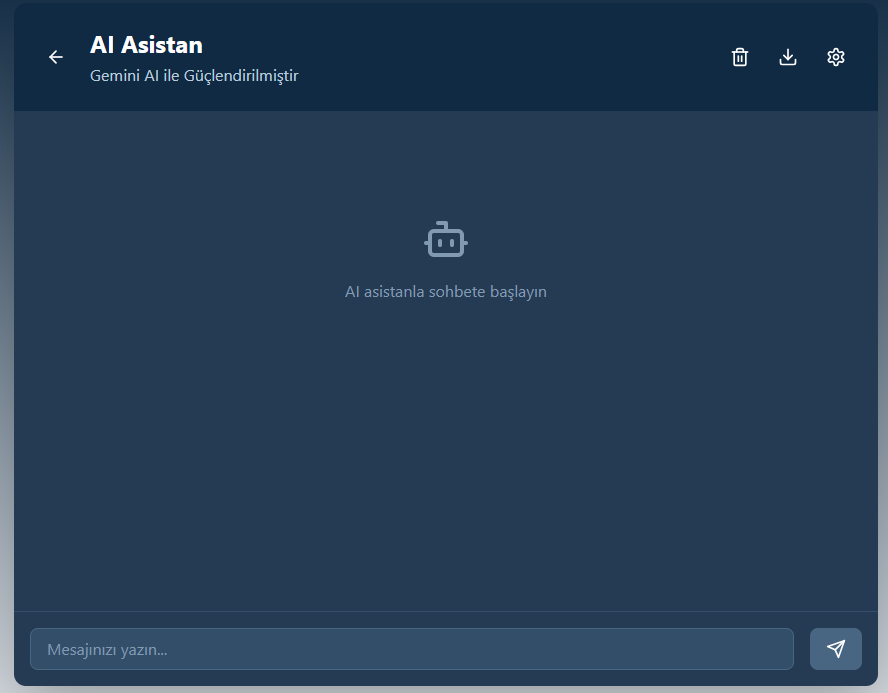

# Project

# AIChat

## Proje Hakkında

Bu proje, çeşitli kullanıcılardan alınan verilerle oluşturulmuş duygu durumlarının analizlerinden yararlanarak sorulara yanıt verebilen bir yapay zeka modelini sunar. Kullanıcıların duygu durumlarının analizleri hakkında sorular sorabileceği bir arayüz sağlanmıştır. Proje, Google Gemini modeli ile fine-tuning işlemi gerçekleştirilmiş bir AIChat içerir ve Netlify ile canlıya alınmıştır.

## Özellikler

Kullanıcıların duygu durumuna odaklı bir yapay zeka içerir ve ek olarak dinamik bir açılış sayfası kullanılarak site içerisine linkedın,gmail ve github hesaplarımı ekledim.Ek olarak chat kısmında kullanıcılara 2 farklı mod sunulmuştur.
- **Yapay Zeka Tabanlı Cevaplama:**
    - Fine-tuning edilmiş Google Gemini modeli, kullanıcı sorularına yanıt verir.
- **Web Arayüzü:**
    - Kullanıcılar, sorularını kolayca arayüz üzerinden sorabilir.

Oluşturduğum AIChat sitesinin giriş sayfası yukarıdaki gibi görünmektedir.

AIChat arayüzü ise bu şekilde görünmektedir.

